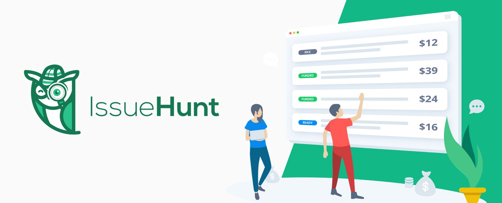

# ✨ IssueHunt Materials - v1

[IssueHunt](https://issuehunt.io/) is an issue-based bounty platform for open-source projects.

Feel free to use images on your Readme and blog :D

## 1. Logo

## 2. Button for GitHub readme

## 3. Shield for GitHub readme

## 4. Ribbon for the landing page

## 5. Logo and word

## 6. Cover image

